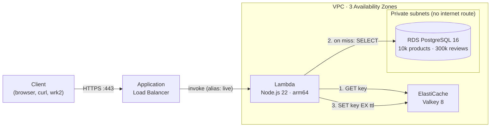

# Serverless Cache API on AWS

A serverless catalog API built with **Terraform**: an **Application Load Balancer** invokes an **AWS Lambda** function that serves reads through **Amazon ElastiCache (Valkey)** with a **cache-aside** strategy, in front of **Amazon RDS (PostgreSQL)** as the source of truth. The whole stack deploys and tears down with one command and was load-tested with [wrk2](https://github.com/giltene/wrk2).

**Result:** on the expensive query, the cache made responses **~20× faster** (46.5 ms → 2.3 ms server time) and, under load, the API served **~15× more successful requests per second** (17.8 → 276.2 req/s), with p99 latency dropping from 20 s to 132 ms.

Built for a Distributed Systems course (ITESO); follows [aws-high-availability-lab](https://github.com/stephy0410/aws-high-availability-lab), which scaled EC2 with an Auto Scaling Group.

**Tech:** AWS (ALB, Lambda, ElastiCache/Valkey, RDS PostgreSQL, VPC, ACM, CloudWatch) · Terraform · Node.js 22 · wrk2 + Lua

## Architecture



- **Network isolation.** RDS lives in dedicated private subnets whose route table has only the local VPC route. Security groups allow only `Internet → ALB (80/443) → Lambda → ElastiCache (6379) / RDS (5432)`; neither data store accepts traffic from anything but the Lambda.
- **Encryption.** HTTPS at the ALB (self-signed certificate imported into ACM, since the lab account has no domain), TLS to ElastiCache and RDS (the Lambda verifies the RDS CA bundle), and encryption at rest on both data stores.

## Caching strategy: cache-aside with invalidation on write

- **Read:** look up the key in ElastiCache. On a **HIT**, return it without touching the database. On a **MISS**, query RDS, store the result with a TTL, and return it.
- **Write** (`PUT /products/{id}`): update RDS first, then **delete** the affected keys (`product:{id}` and `top:{category}`). The next read repopulates them with fresh data.

| Strategy | Why it was not chosen |
|---|---|
| Write-through | Fills the cache with data that may never be read and slows every write; aggregates such as the per-category top list would have to be recomputed on each update. |
| Write-behind | If the cache node fails before syncing, writes (prices, stock) are lost, and Lambda has no reliable background process to flush a queue. |
| Read-through | ElastiCache cannot load from RDS by itself, so in practice it becomes cache-aside implemented in the application. |
| Refresh-ahead | Requires predicting hot keys and a background refresher; the gain over a TTL is marginal here. |

Cache-aside fits a read-heavy catalog with skewed access (80 % of traffic goes to 20 % of products): only what is actually requested gets cached, and if the cache is unavailable the API keeps working against RDS. Deleting instead of updating on write is idempotent, so concurrent writes cannot leave a stale value behind indefinitely.

### Keeping performance stable under concurrency

Implemented in [`app/src/cache.js`](app/src/cache.js):

| Problem | Mitigation |
|---|---|
| **Cache stampede**: a hot key expires and many concurrent invocations hit RDS at once | Per-key lock (`SET lock:<key> NX PX 3000`): one invocation rebuilds the value, the rest wait briefly and read it from cache. |
| **Synchronized expiry**: keys filled together expire together | TTL of 300 s plus 0–60 s of random jitter. |
| **Cache penetration**: lookups for non-existent IDs always reach RDS | Negative results are cached for 30 s. |
| **Cache outage** | Fail-open: 250 ms command timeout, then fall back to RDS (`X-Cache: BYPASS`). |
| **Connection exhaustion** as Lambda scales out | At most one lazily opened Postgres connection per execution environment, plus reserved concurrency of 75, below the 81 connections `db.t3.micro` accepts. The Lambda is sized to the database, not the other way around. |

## Results

### Load test: heavy query, 300 req/s for 60 s

The top-10-by-category query aggregates all 300,000 reviews (~48 ms in RDS vs. ~2 ms from cache), which makes the database the bottleneck.

| Scenario | Requests/sec | Successful req/s | Errors | p90 | p99 |
|---|---|---|---|---|---|
| Without cache | 284.5 | **17.8** | 93.7 % | 10.4 s | 20.0 s |
| With cache | 297.0 | **276.2** | 7.0 % | 102.9 ms | 132.2 ms |

Without the cache, the `db.t3.micro` instance computes the query about 18 times per second; the remaining requests queue for up to 20 s and mostly fail. With the cache, 99.6 % of reads are served from memory.

`Requests/sec` looks nearly identical in both rows because wrk2 holds the request rate constant by design and counts error responses too. That is why the suite also reports **successful** requests per second. A single-product lookup (~3 ms in RDS) is too cheap to ever saturate the database, so it shows little difference; the heavy query is where caching pays off.

### Manual verification: single requests, server time

| Request | Source | Server time |
|---|---|---|
| `/nocache/products/top?category=books` | RDS (`BYPASS`) | 46.5 ms |
| `/cache/products/top?category=books` (first) | RDS, then cached (`MISS`) | 55.9 ms |
| `/cache/products/top?category=books` (second) | ElastiCache (`HIT`) | **2.3 ms** |

Raw output for every run is in [`loadtest/results/`](loadtest/results/).

## API

Each query has a cached and an uncached endpoint running the same database query, so the cache is the only variable.

| Method | Cached | Uncached (always RDS) | Returns |
|---|---|---|---|
| GET | `/cache/products/{id}` | `/nocache/products/{id}` | A product with its review count and average rating |
| GET | `/cache/products/top?category=books` | `/nocache/products/top?category=books` | Top 10 rated products in a category (heavy aggregation) |

| Method | Path | Description |
|---|---|---|
| PUT | `/cache/products/{id}` | Body `{"price": 19.99, "stock": 5}`. Updates RDS and invalidates the cached keys. |
| GET | `/stats` | ElastiCache hits, misses, hit ratio, and key count. |
| GET | `/health` | ALB health check; touches no dependencies. |
| GET | `/` | Web page to exercise the API from a browser, with a request history showing cache source and timings. |

The short paths `/products/…` (cached) and `/db/products/…` (uncached) are equivalent. Every response includes `X-Cache: HIT | MISS | BYPASS` and `X-Duration-Ms` (time spent inside the Lambda, excluding network latency). Categories: `electronics`, `books`, `home`, `toys`, `sports`, `beauty`, `garden`, `grocery`.

On deploy, Terraform invokes the Lambda once (`aws_lambda_invocation`) to create the schema and seed 10,000 products and 300,000 reviews.

## Getting started

**Requirements:** an AWS account (built for AWS Academy Learner Lab) with credentials in the `academy` profile, Terraform ≥ 1.11, Node.js ≥ 22. The Terraform state lives in an S3 bucket that must exist first:

```bash
aws s3 mb s3://stephanie-borrego-sd-lab04 --profile academy   # once; or change the bucket in versions.tf
```

```bash
make deploy                      # install Lambda deps + RDS CA bundle, then terraform init/apply (~15 min)
make smoke                       # hit each endpoint; the second /products/42 call returns X-Cache: HIT
ONLY=top make loadtest           # build wrk2 if needed and run the heavy-query comparison (~2 min)
make destroy                     # tear everything down
```

`terraform output -raw api_url` prints the URL. The certificate is self-signed, so use `curl -k` or accept the browser warning.

## Load testing

[`loadtest/run.sh`](loadtest/run.sh) uses wrk2, which keeps a **constant request rate** and corrects for coordinated omission, so percentiles reflect what real users would see. The Lua workload ([`loadtest/catalog.lua`](loadtest/catalog.lua)) sends 80 % of reads to the 20 % most popular products and counts HIT/MISS from the `X-Cache` header.

| # | Scenario |
|---|---|
| 1 | No cache: every read goes to RDS |
| 2 | Cache-aside with the same traffic, starting from a cold cache |
| 3 | Mixed 95 % reads / 5 % writes, where each write invalidates keys |
| 4 | Step test: 25 → 50 → 100 req/s |
| 5–6 | Heavy query without and with cache (`ONLY=top` runs only these) |

> **Default rates are deliberately low** (100 req/s, 50 req/s for the heavy query, 50 connections). AWS Academy deactivated the original lab account while the suite ran at up to 1000 req/s against this ALB. At 50 req/s the uncached heavy query already saturates RDS.

> **wrk2 on Apple Silicon:** upstream bundles LuaJIT 2.0 and includes `<x86intrin.h>`, so it does not build on arm64. [`loadtest/build-wrk2.sh`](loadtest/build-wrk2.sh) links against Homebrew's LuaJIT 2.1 and OpenSSL and drops the unused header.

## Cost

Sized for a USD 50 lab budget (us-east-1 on-demand pricing): about **USD 1.45 per day** while running.

| Resource | USD/day |
|---|---|
| ALB | ~0.60 |
| ElastiCache `cache.t3.micro` × 1 | 0.41 |
| RDS `db.t3.micro` Single-AZ, 20 GB gp3 | ~0.43 |
| Lambda, CloudWatch Logs | cents |

The cache is what scales, not the database: instead of upsizing RDS, the cache absorbs reads. There is no cache replica, because the cache only holds re-derivable data and the Lambda fails open to RDS. There is also no NAT Gateway (~USD 1/day on its own), because the Lambda never needs the internet.

## Trade-offs

- **Bounded staleness.** Writes invalidate immediately, but the classic cache-aside race can leave a stale value for at most one TTL (≤ 360 s). That is acceptable for catalog prices and stock, not for something like account balances.
- **RDS Proxy** would be the production way to multiplex Lambda connections to Postgres; here, a lazy single connection per environment plus reserved concurrency achieves the same protection at no cost.
- **DB password in a Lambda environment variable** (encrypted with KMS). Secrets Manager would be preferable, but a VPC Lambda without NAT would need an extra VPC endpoint.
- **Provisioned concurrency** would remove cold starts, but AWS Academy blocks it; the load test ramps traffic gradually instead.

## Repository layout

```
network.tf        VPC subnets, private subnets and route table for RDS, security groups
alb.tf            Self-signed certificate in ACM, ALB, listeners (80 → 443), Lambda target group
lambda.tf         Lambda function, alias, optional provisioned concurrency, one-off seed invocation
data_stores.tf    RDS PostgreSQL and ElastiCache (Valkey) with their subnet and parameter groups
variables.tf      Tunables: TTLs, instance sizes, concurrency, seed size
outputs.tf        API URL, endpoints, ready-to-run commands
versions.tf       Providers and S3 remote state backend
app/src/          Lambda code: index.js (routing), cache.js (cache-aside), db.js (RDS), ui.html (web page)
loadtest/         wrk2 build script, Lua workload, test suite, and results
Makefile          build / deploy / smoke / loadtest / destroy
```
