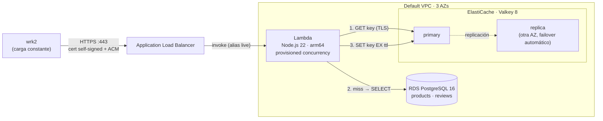

# AWS Serverless Cache API (Lab04)

Laboratorio de **Sistemas Distribuidos**: una API de catálogo servida por **AWS Lambda** detrás de un **Application Load Balancer**, con **Amazon RDS (PostgreSQL)** como fuente de verdad y **Amazon ElastiCache (Valkey, compatible con Redis)** como caché con la estrategia **cache-aside**. Todo se despliega con Terraform sobre una cuenta de **AWS Academy Learner Lab**, y se somete a carga con [**wrk2**](https://github.com/giltene/wrk2).

Es la continuación de [`aws-high-availability-lab`](https://github.com/stephy0410/aws-high-availability-lab) (Lab03): ahí la capacidad venía de un Auto Scaling Group de EC2; aquí el cómputo es serverless (Lambda escala por petición) y el cuello de botella natural —la base de datos— se protege con una capa de caché.

## Arquitectura



## Estrategia de caché elegida: cache-aside (lazy loading) + invalidación en escritura

**Lectura** (`GET /products/{id}`, `GET /products/top?category=…`):

1. La Lambda busca la llave en ElastiCache (`product:42`).
2. **HIT** → responde directo desde memoria (no toca RDS).
3. **MISS** → consulta RDS, guarda el resultado con `SET key EX ttl` y responde.

**Escritura** (`PUT /products/{id}`): actualiza **primero RDS** y luego **borra** (`DEL`) las llaves afectadas (`product:42` y `top:<categoría>`). La siguiente lectura las repuebla con el dato nuevo.

### Por qué esta y no otra

| Estrategia | Cómo funciona | Por qué **no** encaja aquí |
|---|---|---|
| **Cache-aside** ✅ | La app lee de la caché y, si falla, de la BD y rellena la caché | — (elegida) |
| Read-through | La caché misma sabe cargar desde la BD | ElastiCache no puede leer de RDS por sí sola; en la práctica termina implementándose en la app, es decir, cache-aside. |
| Write-through | Cada escritura va a la caché **y** a la BD en la misma operación | Llena la caché con datos que tal vez nadie lea, alarga la latencia de cada escritura, y los agregados (`top` por categoría) habría que recalcularlos en cada `PUT`. |
| Write-behind (write-back) | Se escribe solo en la caché y se sincroniza con la BD después | Si el nodo de caché cae antes de sincronizar, **se pierden escrituras** (precio/stock). Además Lambda no tiene un proceso en segundo plano confiable para vaciar la cola. |
| Refresh-ahead | Se refrescan llaves antes de que expiren | Requiere adivinar qué llaves estarán calientes y un proceso de fondo; en Lambda no existe ese proceso y el beneficio sobre un TTL es marginal. |

Las razones concretas para este caso:

- **Carga dominada por lecturas.** Un catálogo se lee muchísimo más de lo que se modifica (la prueba usa 95 % lecturas / 5 % escrituras). Cache-aside optimiza exactamente ese camino.
- **Acceso sesgado (80/20).** Pocos productos concentran la mayoría de las visitas. Con lazy loading solo se guarda en caché lo que **realmente se pide**, así el "hot set" cabe de sobra en un `cache.t3.micro`, y `allkeys-lru` expulsa lo que deja de usarse.
- **Resiliencia.** La caché es opcional para la correctitud: si ElastiCache no responde, la Lambda cae directo a RDS (`X-Cache: BYPASS`) en lugar de fallar. Con write-through/write-behind, una caída de la caché bloquea o pierde escrituras.
- **Borrar en lugar de actualizar en la escritura.** Si dos escrituras concurrentes intentaran *actualizar* la caché, podrían aplicarse en orden inverso y dejar un valor viejo para siempre. Borrar es idempotente: la siguiente lectura trae lo que haya en RDS.
- **TTL como red de seguridad.** Cache-aside tiene una carrera conocida (un lector lento puede volver a escribir un valor viejo justo después de una invalidación); el TTL (300 s) acota cuánto puede durar esa inconsistencia.

### Protecciones para que el rendimiento no se degrade bajo concurrencia

Implementadas en [`app/src/cache.js`](app/src/cache.js):

| Problema | Protección |
|---|---|
| **Cache stampede**: una llave caliente expira y cientos de Lambdas concurrentes golpean RDS a la vez | Lock por llave con `SET lock:<key> NX PX 3000`: solo una ejecución reconstruye; las demás esperan unos ms y leen de la caché. |
| **Expiración sincronizada**: llaves llenadas juntas expiran juntas | TTL con *jitter* aleatorio: 300 s + 0–60 s. |
| **Cache penetration**: ids que no existen siempre pasan a RDS | Se guarda también el "no existe" (`null`) con TTL corto (30 s). |
| **Caché caída** | Fail-open: timeout de 250 ms por comando y fallback a RDS. |
| **Demasiadas conexiones a RDS** al escalar Lambda | Pool de 1 conexión por ejecución, creada **perezosamente** (una Lambda que solo sirve HITs nunca abre conexión), y `reserved_concurrency = 60` como techo duro. |
| **Cold starts** al llegar un pico | `provisioned concurrency = 10` en el alias `live`: entornos ya inicializados con el TLS a ElastiCache hecho. |

## Endpoints

| Método | Ruta | Descripción |
|---|---|---|
| GET | `/health` | Health check del ALB (no toca dependencias). |
| GET | `/products/{id}` | Producto + estadísticas de reseñas (cache-aside). Header `X-Cache: HIT \| MISS \| BYPASS`. |
| GET | `/products/top?category=books` | Top 10 mejor calificados de la categoría (agregación pesada, cache-aside). |
| PUT | `/products/{id}` | Body `{"price": 19.99, "stock": 5}`. Escribe en RDS e invalida la caché. |
| GET | `/db/products/{id}` | Igual que `/products/{id}` pero **siempre** va a RDS. Es la línea base de la prueba de carga. |
| GET | `/stats` | `keyspace_hits`, `keyspace_misses` y *hit ratio* de ElastiCache. |

Datos: 10 000 productos en 8 categorías y 300 000 reseñas, sembrados por Terraform con una invocación única de la Lambda (`aws_lambda_invocation`).

## Qué hace cada pieza

| Pieza | Recurso Terraform | Qué hace |
|---|---|---|
| **ALB** | `aws_lb`, `aws_lb_listener` (80→301 a 443, 443 HTTPS), `aws_lb_target_group` (`target_type = "lambda"`) | Recibe HTTPS e invoca la Lambda por cada petición. |
| **Lambda** | `aws_lambda_function`, `aws_lambda_alias`, `aws_lambda_provisioned_concurrency_config` | Node.js 22 en Graviton (arm64), dentro de la VPC, rol `LabRole` (Academy no permite crear roles IAM). |
| **ElastiCache** | `aws_elasticache_replication_group` | Valkey 8, primario + réplica en otra AZ con failover automático, cifrado en tránsito y en reposo, `maxmemory-policy = allkeys-lru`. |
| **RDS** | `aws_db_instance` | PostgreSQL 16, `db.t3.micro`, no público, cifrado; la Lambda verifica su certificado con el bundle de CA de RDS. |
| **Security Groups** | `aws_security_group` | Internet → ALB (80/443). ElastiCache (6379) y RDS (5432) solo aceptan tráfico del SG de la Lambda. |
| **Cert self-signed + ACM** | `tls_private_key`, `tls_self_signed_cert`, `aws_acm_certificate` | HTTPS gratuito en el ALB (sin dominio en Academy → `curl -k`). |

## Estructura del repo

```
alb.tf            # Cert self-signed + ACM, ALB, listeners, target group de tipo lambda
lambda.tf         # Lambda, alias, provisioned concurrency, invocación de seed
data_stores.tf    # RDS PostgreSQL y ElastiCache (Valkey) + subnet/parameter groups
network.tf        # VPC/subnets por defecto (sin use1-az3, que Lambda no soporta) y security groups
variables.tf      # Parámetros (TTL, tamaños, concurrencia, datos de seed...)
outputs.tf        # URL, endpoints y comandos listos para copiar
versions.tf       # Providers + backend remoto S3 (key lab04/terraform.tfstate)
app/src/          # Código de la Lambda: index.js (rutas), cache.js (cache-aside), db.js (RDS)
loadtest/         # wrk2: script de build, workload Lua, suite de pruebas y resultados
Makefile          # build / deploy / smoke / loadtest / destroy
```

## Cómo desplegarlo

Requisitos: AWS Academy Learner Lab con credenciales en el perfil `[academy]`, Terraform ≥ 1.11, Node.js ≥ 22.

```bash
make deploy      # npm install + bundle CA de RDS + terraform init/apply  (~15 min: RDS y ElastiCache)
make smoke       # prueba cada endpoint; la segunda llamada a /products/42 muestra X-Cache: HIT
make loadtest    # compila wrk2 (si hace falta) y corre la suite completa
make destroy     # borra todo (las ENIs de la Lambda en VPC pueden tardar ~20 min en liberarse)
```

## Prueba de carga con wrk2

[`loadtest/run.sh`](loadtest/run.sh) usa [wrk2](https://github.com/giltene/wrk2), que a diferencia de `wrk` mantiene una **tasa constante** (`-R`) y corrige la *coordinated omission*: si el servidor se frena, las peticiones que "deberían" haberse enviado cuentan su espera en la latencia, así que los percentiles son los que vería un usuario real.

El workload ([`loadtest/catalog.lua`](loadtest/catalog.lua)) reproduce un catálogo real: 80 % de las lecturas van al 20 % de productos más populares, y cuenta HIT/MISS a partir del header `X-Cache`.

Escenarios:

1. **Sin caché**: todas las lecturas a RDS (`/db/products/{id}`).
2. **Cache-aside**: el mismo tráfico por `/products/{id}`, empezando con la caché fría.
3. **Mixto 95/5**: 5 % de `PUT` que invalidan llaves.
4. **Escalonado**: 250 → 500 → 1000 → 1500 req/s para ver si la latencia se mantiene plana.

> **wrk2 en Apple Silicon:** el repo original trae LuaJIT 2.0 e incluye `<x86intrin.h>`, así que no compila en arm64. [`loadtest/build-wrk2.sh`](loadtest/build-wrk2.sh) lo enlaza contra LuaJIT 2.1 y OpenSSL de Homebrew y quita ese header (no se usa). En Linux x86_64 compila tal cual.

### Resultados

RESULTS_PLACEHOLDER

## Trade-offs reconocidos

- **Consistencia eventual acotada.** Tras un `PUT`, la caché se invalida al instante, pero la carrera clásica de cache-aside puede dejar un valor viejo como máximo un TTL (≤ 360 s). Para precios/stock de un catálogo es aceptable; para un saldo bancario no lo sería.
- **Todo va al primario de ElastiCache.** Leer de la réplica escalaría más las lecturas, pero con lag de replicación una lectura justo después de una invalidación podría ver el valor viejo. Con el volumen de este lab un nodo sobra.
- **RDS Proxy** sería la forma "de producción" de multiplexar conexiones Lambda → Postgres; aquí se controla con pool de 1 + conexión perezosa + reserved concurrency.
- **Password de RDS en variable de entorno** (cifrada con KMS por Lambda). Secrets Manager sería lo ideal, pero una Lambda en VPC sin NAT necesitaría un VPC endpoint adicional.
- El certificado del ALB es self-signed (no hay dominio en Academy), igual que en los labs anteriores.
- AWS Academy Learner Lab borra recursos al expirar la sesión; el state remoto en S3 permite retomar el tracking con Terraform.
